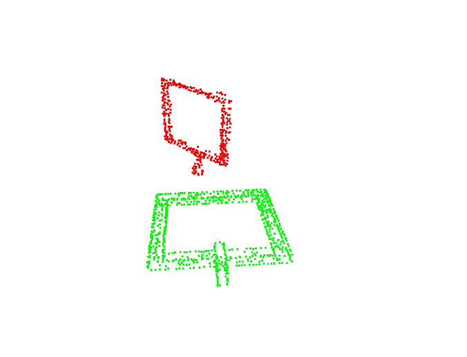

RGB image --> text2mask.py --> mask of the interested object 

Depth image & mask --> depth2pointcloud.py --> dense point cloud of the interested object 

dense point cloud --> keypointPCL.cpp --> key point of the point cloud 

ground truth target mesh file --> mesh2PCD.py --> dense point cloud of the ground truth target 

dense point cloud of the ground truth target --> keypointPCL.cpp --> key point cloud of the ground truth target

key point of the target & ground truth key point of the target --> PCDmatch.py (rough R, t & precise R, t) --> global R, t

todo: 
nornal_vector_render

# depth2pointcloud.py 
input: depth image \
output: pointcloud (o3d) 

# keypointPCL.cpp
input: point cloud (dense PCD) \
output: key point cloud (sparce PCD ) 

# text2mask.py 
input: rgb image, prompt word. \
output: mask of the interested target. 

<!-- 并排显示前两张图 -->

  
  

<!-- 并排显示后三张图 -->

  
  
  

### First Image
- **Green**: Ground truth  
- **Red**: Point cloud derived from converting the real-world depth image into a point cloud  

### Second Image
- **Green** and **Red**: Same meaning and positions as in the first image  
- **Blue**: An initial, relatively rough \(R\) and \(T\) result from FPFH feature matching and iterative alignment.  
  - This \(R\) and \(T\) only moves the ground truth to a position roughly close to the real-world captured point cloud.  

### Third Image
- **Green** and **Red**: Meanings and positions unchanged  
- **Blue**: The final result after ICP.  
  - Compared to the second image, it’s more accurate.  
  - There are still issues (e.g., the base is flipped), but that doesn’t matter much because we mainly care about the box’s orientation. As long as the plane’s normal vector is correct, it’s acceptable.
